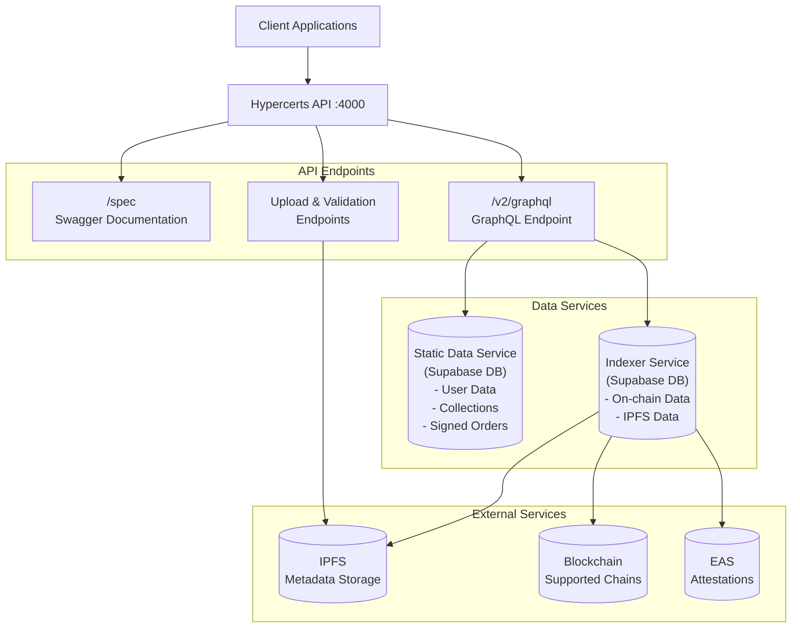

# Hypercerts API

The hypercerts API is the touchpoint for developers to interact with the hypercerts ecosystem. It provides endpoints for data upload and fetching, a GraphQL API for querying (on-chain) state and a health check endpoint.

## Getting started

### Environment variables

#### W3UP

In `env.template` you'll find KEY and PROOF which are [w3up](https://web3.storage/docs/w3up-client/) key and proofs which you need to set up yourself for local otherwise you'll be superadmin 😉

#### Supabase JS

SupabaseJS is used to connect to both the the caching and data service. The local variables are deterministic and provided in the template.

#### Kysely

Kysely is implemented in favor of SupabaseJS as it allows for more flexibility and complexity in queries. To connect to the database you need to set the `CACHING_DATABASE_URL` and `DATA_DATABASE_URL` in the `.env` file. By default, the local variables are set to the local Supabase instance.

#### Sentry

Sentry is used for monitoring and error reporting. You can read more about it [here](https://docs.sentry.io/platforms/javascript/guides/node/configuration/env-vars/). When Sentry is set to `local` it will be disabled by default.

#### RPCs

The API implements a fallback to the first available RPC. You can set the RPCs in the `.env` file.

### Supabase

- Install Docker
- `git submodule init`
- `git submodule update --remote`
- `pnpm supabase:start:all`

This will spin up 2 Supabase instances in Docker, one for the indexer service (caching) and one for the data service (static data) which are both exposed by the API.

From both instances, you can get their respective keys and add them to the env vars. When in doubt you can run `supabase status` to fetch the keys again. By default this is not needed for local development.

### Run the API locally

`pnpm dev`

This will run a live production instance by running `swc` to compile the code and `nodemon` to restart the server on changes.

You can then find the API at `localhost:4000/spec` (Swagger instance) and the GraphQL at `localhost:4000/v2/graphql`

## Deployments

Production: `https://api.hypercerts.org/`
Staging: `https://staging-api.hypercerts.org`

`/spec` - Swagger instance documenting the API and exposing a playground to experiment with the endpoints
`/v2/graphql` - GraphQL API to access hypercerts data like claims, fractions, attestations, allow lists

## Scripts

- `dev`: Starts the development server using `nodemon`, which will automatically restart the server whenever you save a file that the server uses.
- `build`: Denerates the OpenAPI specification and routes using `tsoa`, and then compiles the TypeScript code into JavaScript using `swc`. The compiled code is output to the `dist` directory.
- `start`: Starts the application in production mode.
- `lint`: Runs `eslint` on the codebase to check for linting errors.
- `test`: Runs tests using `vitest`

## Data

The API service exposes data from two sources:

- The static data service which contains off-chain data like user data, hypercert collections, signed order messages, etc.
- The indexer service which contains on-chain data about hypercerts and the linked data on IPFS (hypercerts, ownerships, metadata, attestations, etc.)

### Static data service

The static data service is a Supabase database which is exposed by the API. This means that you can create, update and delete data through the API. For read functionality we recommend using the GraphQL API and playground to carefully compose the data model needed for your use case.

### Indexer service

The indexer service monitors our supported chains for relevant events and handles those events accordingly. All data exposed by the indexer service is available in different sources as well, like IPFS for metadata and EAS for attestations.

## Validations

The API also provides an upload and validation endpoint for hypercert and allow list data. In the [live docs](https://api.hypercerts.org/spec) you can find the endpoint and docs. Generally, by using `validate` you can post the data for validation without it being uploaded to IPFS.

## Architecture

